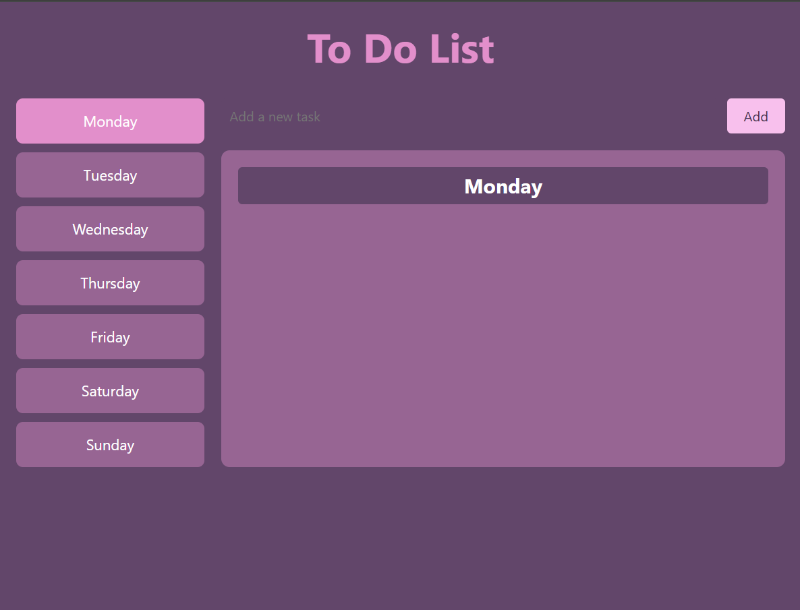
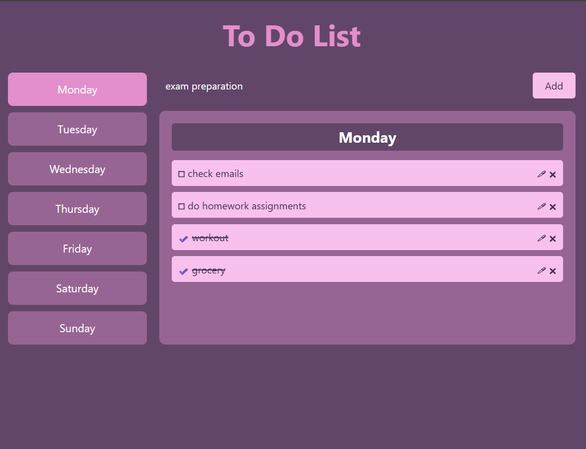

# To-Do List App

This is a lightweight and interactive To-Do List web application built using HTML, CSS, JavaScript, and jQuery. It allows users to manage daily tasks efficiently through a simple and responsive interface.

---

## 📝 Features

- Adding new tasks dynamically
- Marking tasks as completed
- Deleting tasks from the list
- Saving tasks using localStorage
- Clean and intuitive UI powered by jQuery

---

## 🔧 Technologies Used

- **HTML5**
- **CSS3**
- **JavaScript (ES6)**
- **jQuery**

---

  
